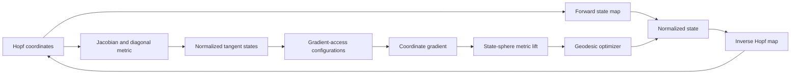

# The Hopf Ansatz: reference implementation and reproducibility

Reference code, engineering conventions, validation safeguards, and reproducible
experiments for:

**A Compass on the Quantum State Sphere: The Hopf Ansatz for Arbitrary
Pure-State Optimization**  
Ruge Lin and Guangxi Li (2026)

[Read the paper on arXiv](https://arxiv.org/abs/2607.14231)

The Hopf ansatz is a fixed binary-tree circuit family for arbitrary normalized
real and complex pure states. In addition to forward state preparation, it
provides an explicit inverse map, a diagonal pullback metric, exactly preparable
normalized coordinate tangents, structured gradient access, and
geometry-aware optimization on the state sphere.

This repository is a research reference implementation. It is not a production
SDK and not a hardware benchmark.

## Choose a route

| Goal | Start here |
|---|---|
| Check whether the repository supports a paper claim | [Claim support and evidence map](docs/CLAIM_SUPPORT.md) |
| Implement the chart, inverse map, metric, tangents, or gate schedule | [Engineering guide](docs/ENGINEERING_GUIDE.md) |
| Understand the numerical studies and safeguards | [Experiments and evidence](docs/EXPERIMENTS.md) |
| Reproduce the scripts and generated data | [Reproducibility checklist](REPRODUCIBILITY.md) |
| Inspect the second-paper reverse-gradient constructions | [Hopf-QBP repository](https://github.com/GoGoKo699/Hopf-QBP) |

## What is implemented

For `n` qubits and `N = 2**n`, the repository implements:

- real Hopf coordinates with `N - 1` parameters;
- complex Hopf coordinates with `N - 1` magnitude angles and `N` leaf phases;
- forward maps from Hopf coordinates to normalized state vectors;
- explicit inverse maps from normalized state vectors to Hopf coordinates;
- exact Jacobians and analytic diagonal metrics;
- parameter assignments that prepare normalized coordinate tangents on the
  same circuit skeleton;
- deterministic `HopfReal` and `HopfComplex` gate schedules;
- optional Qibo circuit construction and statevector parity checks;
- boundary-safe real and complex coordinate-gradient routines;
- geometry-native state-sphere optimizers;
- assigned no-clean-ancilla CNOT ledgers;
- real and complex optimization stress tests;
- a fixed-state finite-shot gradient safeguard; and
- a local real/complex Qibo layerwise-gradient safeguard.

The repository keeps proofs, the four-qubit pedagogical walkthrough, and the
paper's extended motivation in the paper. The documentation here is organized
around verifiable claims and implementable interfaces.

## Coordinate summary

The complete binary tree has `N` computational-basis leaves and `N - 1`
internal nodes. Internal nodes are indexed breadth first, starting at `1`.
Basis states are ordered as

```math
\lvert q_n\cdots q_1\rangle,
```

with the path read from most-significant bit to least-significant bit.

| Chart | Coordinate order | Canonical ranges |
|---|---|---|
| Real | `theta_1, ..., theta_(N-1)` | non-final magnitude angles in `[0, pi/2]`; final internal layer in `[0, 2*pi)` to encode real signs |
| Complex | `theta_1, ..., theta_(N-1), theta_N, ..., theta_(2N-1)` | all magnitude angles in `[0, pi/2]`; one leaf phase in `[0, 2*pi)` per basis state |

The maps parameterize normalized state-vector spheres. As with ordinary
spherical coordinates, zero-weight subtrees and zero-amplitude leaves admit
nonunique coordinate representatives. The implementation fixes explicit
inverse-map conventions for those cases.

## Structure at a glance



The core API is in `hopf_utils.py`. The other scripts either exercise that API,
construct optimization studies, or validate a specific implementation claim.

## Quick start

Use Python 3.10 or newer.

```bash
python -m venv .venv
source .venv/bin/activate
python -m pip install --upgrade pip
python -m pip install -r requirements.txt
```

Install Qibo only for explicit circuit checks:

```bash
python -m pip install -r requirements-optional.txt
```

Run the core map, inverse, metric, tangent, and optional Qibo checks:

```bash
python hopf_utils.py
```

Run the assigned CNOT-count safeguard:

```bash
python hopf_gate_count.py --nmin 2 --nmax 10 --out hopf_gate_count.pdf
```

Run the small layerwise-gradient safeguard:

```bash
MPLBACKEND=Agg python VQE_qibo.py
```

Run the fixed-state finite-shot safeguard:

```bash
python finite_shot_sanity_check.py
```

Run the focused complex-Hopf stress test:

```bash
python hopf_complex.py
```

For the full multi-size real-Hopf study and all diagnostic commands, use
[REPRODUCIBILITY.md](REPRODUCIBILITY.md).

## Evidence snapshots

The committed figures summarize three different checks. They should not be
interpreted as one combined benchmark.

<p align="center">
  
  
  
</p>

- `hopf_complex.png` summarizes a focused complex-chart optimization study.
- `finite_shot_sanity.png` isolates the statistical convergence of one signed-branch estimator.
- `VQE_qibo.png` checks local real and complex layerwise circuit realizability at `n = 4`.

The exact meaning, settings, and limitations of each panel are documented in
[docs/EXPERIMENTS.md](docs/EXPERIMENTS.md).

## Repository map

| Path | Role |
|---|---|
| `hopf_utils.py` | Coordinate maps, inverse maps, Jacobians, metrics, tangent assignments, native gate schedules, and optional Qibo circuit checks. |
| `hopf_gate_count.py` | Generated-schedule versus closed-form assigned CNOT safeguard. |
| `hopf_data.py` | Multi-size real-Hopf geometry-native optimization data generator. |
| `adam_data.py` | Real Hopf-Adam and ideal Möttönen-parameter-shift-equivalent baselines. |
| `diagnose_hopf.py` | Streaming completeness and numerical diagnostics for geometry-native CSV data. |
| `diagnose_adam.py` | Streaming diagnostics for the Adam baseline CSV data. |
| `plot_hopf.py` | Aggregate and per-task plots from regenerated real-Hopf and Adam datasets. |
| `hopf_complex.py` | Focused complex-Hopf stress test, diagnostics, and committed summary figure. |
| `finite_shot_sanity_check.py` | Fixed-state signed-branch estimator check and committed statistical figure. |
| `VQE_qibo.py` | Local real/complex layerwise-gradient circuit safeguard and committed VQE figure. |
| `docs/CLAIM_SUPPORT.md` | Reviewer-facing claim-to-code and claim-to-evidence map. |
| `docs/ENGINEERING_GUIDE.md` | Self-contained implementation and adaptation guide. |
| `docs/EXPERIMENTS.md` | Experimental designs, outputs, reported results, and interpretation limits. |
| `REPRODUCIBILITY.md` | Clean-environment commands and complete data-regeneration workflow. |

## Validation boundaries

This repository directly checks finite-dimensional identities, generated gate
schedules, exact statevectors, estimator behavior, and deterministic numerical
studies. It does not numerically prove mathematical statements that hold for
arbitrary `n`.

It also does not claim:

- hardware-noise robustness;
- device routing or approximate synthesis costs;
- a complete physical shot budget for arbitrary Hamiltonians;
- superiority of one optimizer on all objectives;
- a complex Möttönen baseline;
- a production automatic-differentiation framework; or
- that the local `n = 4` Qibo demonstration is an asymptotic scaling implementation.

The assigned CNOT counts exclude observable measurement, routing, synthesis,
and hardware-specific overhead unless explicitly stated.

## Relation to Hopf-QBP

This repository accompanies the first paper and provides the chart, inverse
map, geometry, native schedules, optimization studies, and the original
layerwise-gradient safeguards.

The separate [Hopf-QBP repository](https://github.com/GoGoKo699/Hopf-QBP)
accompanies the second paper. It provides exact-logical global-frame,
direct-phase, and checkpointed reverse-gradient constructions, together with a
reviewer claim map and a dedicated engineering guide. The two repositories are
complementary and have no runtime dependency on one another.

## Citation

For the Hopf ansatz and the scientific results in this repository, cite:

**Ruge Lin and Guangxi Li, “A Compass on the Quantum State Sphere: The Hopf
Ansatz for Arbitrary Pure-State Optimization,” arXiv:2607.14231 (2026).**

```bibtex
@article{lin2026hopf,
  title   = {A Compass on the Quantum State Sphere:
             The Hopf Ansatz for Arbitrary Pure-State Optimization},
  author  = {Lin, Ruge and Li, Guangxi},
  journal = {arXiv preprint arXiv:2607.14231},
  year    = {2026},
  url     = {https://arxiv.org/abs/2607.14231}
}
```

## License

This software is released under the [MIT License](LICENSE).
