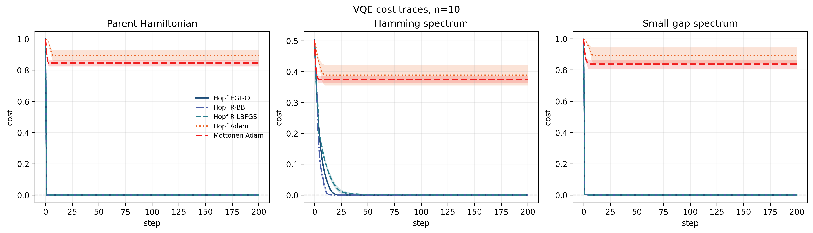
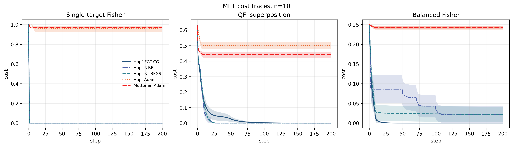

# Hopf Ansatz Stress-Test Code

This repository contains reproducible synthetic stress-test code for the Hopf ansatz.

The code generates synthetic VQE and metrology-inspired optimization traces, runs seed-aware diagnostics, produces GitHub-facing comparison plots, and includes standalone safeguard scripts for the Hopf CNOT-count formulas and the circuit-level real-Hopf gradient construction.

Generated datasets, diagnostic reports, local safeguard outputs, and paper-facing figure outputs are intentionally not committed. They can be regenerated from the scripts.

## Repository contents

| File | Role |
|---|---|
| `hopf_utils.py` | Core Hopf utilities: real and complex coordinate maps, inverse maps, Jacobians, diagonal metrics, tangent-state assignments, gate schedules, and optional Qibo circuit checks. |
| `hopf_data.py` | Generates synthetic stress-test CSVs for the three geometry-native Hopf optimizers. |
| `adam_data.py` | Generates synthetic stress-test CSVs for the two adaptive Adam baselines. |
| `diagnose_hopf_data.py` | Checks completeness and numerical quality of Hopf optimizer CSVs. |
| `diagnose_adam.py` | Checks completeness and numerical quality of Adam baseline CSVs. |
| `plot_hopf.py` | Generates Hopf-only summary and convergence plots from Hopf CSVs. |
| `plot_all.py` | Generates plain-scale GitHub comparison plots including both Hopf optimizers and Adam baselines. |
| `hopf_gate_count.py` | Safeguard script for the CNOT-count formulas. It builds real and complex Hopf gate schedules and checks numerical counts against the closed-form binomial formulas. |
| `VQE_qibo.py` | Circuit-level safeguard script for the real-Hopf gradient formula. It builds explicit Qibo ancilla circuits for transition-moment estimation in a small VQE example. |

## Preview plots

The two plots below are plain-scale GitHub preview plots at `n=10`. They are not paper-facing figures.





To regenerate these preview plots locally, generate the datasets and run `plot_all.py`; see the sections below.

## Requirements

Use Python 3.10 or newer.

Install the required packages for data generation, diagnostics, CNOT counting, and plotting:

```bash
pip install numpy scipy matplotlib
```

Optional package for circuit-level checks:

```bash
pip install qibo
```

`qibo` is only needed for optional circuit checks in `hopf_utils.py` and for the standalone circuit-safeguard script `VQE_qibo.py`. The synthetic data-generation, diagnostic, CNOT-count, and plotting scripts do not require Qibo.

## Quick smoke test

Run a small two-qubit test before generating the full datasets.

```bash
mkdir -p data_smoke figures_smoke

python hopf_data.py \
    --n 2 \
    --steps 2 \
    --num-seeds 2 \
    --scramble-depth 1 \
    --outdir data_smoke

python adam_data.py \
    --n 2 \
    --steps 2 \
    --num-seeds 2 \
    --scramble-depth 1 \
    --outdir data_smoke

python diagnose_hopf_data.py \
    --indir data_smoke \
    --ns 2 \
    --steps 2 \
    --num-seeds 2 \
    --out data_smoke/hopf_data_diagnostics.txt

python diagnose_adam.py \
    --indir data_smoke \
    --ns 2 \
    --steps 2 \
    --num-seeds 2 \
    --out data_smoke/adam_data_diagnostics.txt

python plot_all.py \
    --hopf-dir data_smoke \
    --adam-dir data_smoke \
    --n 2 \
    --outdir figures_smoke
```

Expected generated files include:

```text
data_smoke/vqe_hopf_data_n2.csv
data_smoke/met_hopf_data_n2.csv
data_smoke/vqe_adam_data_n2.csv
data_smoke/met_adam_data_n2.csv
data_smoke/hopf_data_diagnostics.txt
data_smoke/adam_data_diagnostics.txt
figures_smoke/all_vqe_n2_clean.png
figures_smoke/all_met_n2_clean.png
```

## Full data generation

The default experiment uses:

- system sizes `n = 6, 7, 8, 9, 10`;
- `200` optimization updates, with step `0` also recorded;
- `10` deterministic initial-state seeds per fixed synthetic task;
- three VQE tasks and three metrology-inspired tasks per system size;
- three geometry-native Hopf optimizer modes;
- two adaptive Adam baseline modes.

Generate the full Hopf and Adam datasets:

```bash
mkdir -p data

for n in 6 7 8 9 10; do
    python hopf_data.py --n "$n" --outdir data
    python adam_data.py --n "$n" --outdir data
done
```

Default Hopf outputs:

```text
data/vqe_hopf_data_n6.csv
data/met_hopf_data_n6.csv
...
data/vqe_hopf_data_n10.csv
data/met_hopf_data_n10.csv
```

Default Adam outputs:

```text
data/vqe_adam_data_n6.csv
data/met_adam_data_n6.csv
...
data/vqe_adam_data_n10.csv
data/met_adam_data_n10.csv
```

Per system size and task family, the default row counts are:

```text
Hopf CSV: 3 tasks × 10 seeds × 3 modes × 201 recorded steps = 18,090 rows
Adam CSV: 3 tasks × 10 seeds × 2 modes × 201 recorded steps = 12,060 rows
```

The CSV files can be large because each row stores scalar diagnostics as well as semicolon-separated parameter and gradient vectors.

The diagnostic and plotting scripts also accept `.csv.gz` files, so generated CSVs may be compressed after creation:

```bash
gzip data/*.csv
```

## Synthetic tasks

Each task is scrambled by a fixed real orthogonal circuit. This prevents the optimizers from exploiting an obvious computational-basis target.

### VQE tasks

| ID | Name | Objective | Stress feature |
|---|---|---|---|
| `VQE-1` | Parent Hamiltonian | Minimize `1 - |<tau|psi>|^2`. | Direct scrambled target-state recovery. |
| `VQE-2` | Scrambled Hamming spectrum | Minimize a Hamming-distance spectrum conjugated by the scrambler. | Structured diagonal spectrum hidden by a real orthogonal circuit. |
| `VQE-3` | Small-gap spectrum | Minimize a scrambled diagonal Hamiltonian with one ground state and one nearby excited state at gap `1e-2`. | A small spectral gap near the optimum. |

### Metrology-inspired tasks

| ID | Name | Objective | Stress feature |
|---|---|---|---|
| `MET-1` | Single-target Fisher | Minimize `1 - F`, where `F = <tau|rho|tau>^2`. | Nonlinear single-target fixed-readout Fisher proxy. |
| `MET-2` | QFI superposition | Maximize normalized pure-state QFI for a scrambled diagonal generator. | Optimum is an equal superposition of the extremal generator eigenstates. |
| `MET-3` | Balanced Fisher | Minimize a soft-min gap for two target Fisher contributions. | Nonlinear two-target objective requiring balanced overlap. |

Lower cost or gap is better in all diagnostic summaries.

## Optimizer modes

### Geometry-native Hopf optimizers

Generated by `hopf_data.py`:

```text
Hopf-EGT-CG
Hopf-Riemannian-LBFGS
Hopf-Riemannian-BB
```

These modes use the same cost-plus-Hopf-coordinate-gradient interface. The Hopf diagonal metric is used to lift coordinate gradients to state-sphere gradients, and accepted states are mapped back to Hopf coordinates.

### Adam baselines

Generated by `adam_data.py`:

```text
Hopf-Adam
Mottonen-ideal-PS-Adam
```

`Hopf-Adam` applies Adam directly to Hopf coordinates.

`Mottonen-ideal-PS-Adam` applies Adam to the physical post-multiplexing Möttönen rotation angles with an exact gradient equivalent to infinite-shot parameter shift.

Both Adam baselines use adaptive cost-only backtracking. Trial evaluations are additional objective calls, not additional gradient, metric-estimation, Hessian, or Hamiltonian-action primitives.

## Seed convention

By default, every fixed synthetic task is run from `10` deterministic initial-state seeds.

The default seed rule is:

```text
run_seed = problem_seed + seed_offset + seed_index
```

with:

```text
seed_offset = 77777
seed_index = 0, 1, ..., num_seeds - 1
```

The default `num_seeds` is `10`.

To change the number of initial states, pass the same value to both the data-generation and diagnostic scripts:

```bash
python hopf_data.py --n 8 --num-seeds 5 --outdir data
python adam_data.py --n 8 --num-seeds 5 --outdir data

python diagnose_hopf_data.py --indir data --ns 8 --num-seeds 5
python diagnose_adam.py --indir data --ns 8 --num-seeds 5
```

## Diagnostics

Run diagnostics after generating the datasets.

```bash
mkdir -p diagnostics

python diagnose_hopf_data.py \
    --indir data \
    --ns 6-10 \
    --steps 200 \
    --num-seeds 10 \
    --out diagnostics/hopf_data_diagnostics.txt

python diagnose_adam.py \
    --indir data \
    --ns 6-10 \
    --steps 200 \
    --num-seeds 10 \
    --out diagnostics/adam_data_diagnostics.txt
```

The reports check:

- expected files and row counts;
- expected task, mode, seed, and step completeness;
- CSV parse errors;
- sampled parameter and gradient vector lengths;
- nonfinite metrics or gradients;
- state-norm errors;
- aggregate final gaps;
- win counts and final rankings.

The diagnostic scripts are streaming and avoid loading the full vector columns into pandas.

## Plotting

### Hopf-only plots

Use `plot_hopf.py` for plots involving only the three geometry-native Hopf optimizers.

```bash
python plot_hopf.py \
    --indir data \
    --outdir figures_hopf_clean \
    --ns 6-10 \
    --detail-n 10 \
    --formats pdf png \
    --error-band sem \
    --band-alpha 0.18
```

Default outputs:

```text
figures_hopf_clean/hopf_geometric_summary_clean.pdf
figures_hopf_clean/hopf_geometric_summary_clean.png
figures_hopf_clean/hopf_geometric_n10_convergence_clean.pdf
figures_hopf_clean/hopf_geometric_n10_convergence_clean.png
```

These are reproducible Hopf-only outputs and are not committed by default.

### Hopf-plus-Adam GitHub comparison plots

Use `plot_all.py` for plain-scale comparison plots including both Hopf optimizers and Adam baselines.

```bash
python plot_all.py \
    --hopf-dir data \
    --adam-dir data \
    --outdir figures_all_clean \
    --n 10 \
    --formats pdf png \
    --error-band sem \
    --band-alpha 0.18
```

Default outputs:

```text
figures_all_clean/all_vqe_n10_clean.pdf
figures_all_clean/all_vqe_n10_clean.png
figures_all_clean/all_met_n10_clean.pdf
figures_all_clean/all_met_n10_clean.png
```

To use the generated PNGs as the README preview images, copy them to the repository root:

```bash
cp figures_all_clean/all_vqe_n10_clean.png .
cp figures_all_clean/all_met_n10_clean.png .
```

The plotting scripts support the following error-band options:

```text
sem
std
none
```

The default is `sem`. The `--band-alpha` option controls the transparency of the shaded bands.

## Optional Hopf utility checks

Run:

```bash
python hopf_utils.py
```

This executes consistency checks for inverse mapping, tangent-state synthesis, metric/Jacobian agreement, and optional Qibo circuit agreement when Qibo is installed.

## Safeguard scripts

The repository includes two standalone safeguard scripts. They are not part of the main synthetic-data pipeline, and their generated figure files are not committed.

### CNOT-count safeguard

Run:

```bash
python hopf_gate_count.py
```

This prints a table of real and complex Hopf CNOT counts for the default range `n = 4, ..., 20`, using the no-clean-ancilla CNOT model stated in the paper. It also saves a local plot named:

```text
hopf_gate_count.pdf
```

To choose a smaller range and write the local output into a generated-figure folder:

```bash
mkdir -p figures_safeguards

python hopf_gate_count.py \
    --nmin 2 \
    --nmax 10 \
    --out figures_safeguards/hopf_gate_count.pdf
```

The script compares counts obtained directly from the generated Hopf gate schedules against the closed-form binomial count formulas. The saved plot is only a local check and is not shown in this README.

### Qibo circuit-level gradient safeguard

Run:

```bash
MPLBACKEND=Agg python VQE_qibo.py
```

This script uses Qibo to build explicit ancilla Hadamard-test circuits for real-Hopf tangent-state transition moments of the form:

```text
Re <partial_i psi(theta)| P_alpha |psi(theta)>
```

inside a small TFIM VQE example. It compares a sampled circuit-gradient trajectory with an exact state-vector-gradient trajectory and writes:

```text
VQE_ADAM_MC_qibo.pdf
```

This output is a local circuit-realizability check and is not shown in this README.

## Reproducibility notes

The scripts use deterministic random seeds by default. Re-running the same commands with the same Python, NumPy, and SciPy versions should reproduce the same synthetic task definitions and initial-state seeds.

The optimization experiments are exact state-vector simulations. They do not model finite-shot sampling noise.

The generated stress-test datasets use the real Hopf chart. `hopf_utils.py` also contains real and complex Hopf utilities used by the paper.

## Suggested `.gitignore`

Generated data, diagnostics, local safeguard outputs, and paper-facing figures are reproducible and should usually stay out of version control.

```gitignore
# Python
__pycache__/
*.py[cod]
.venv/
venv/

# Generated CSV data
data/
data_smoke/
*_hopf_data_n*.csv
*_adam_data_n*.csv
*_hopf_data_n*.csv.gz
*_adam_data_n*.csv.gz

# Diagnostics
diagnostics/
*_diagnostics.txt
hopf_data_diagnostics.txt
adam_data_diagnostics.txt

# Generated figures
figures_smoke/
figures_hopf_clean/
figures_all_clean/
figures_safeguards/

# Safeguard-script local outputs
hopf_gate_count.pdf
hopf_gate_count.png
hopf_gate_count.svg
VQE_ADAM_MC_qibo.pdf

# Local notebook/editor files
.ipynb_checkpoints/
.DS_Store
```

The two GitHub preview images may be committed at the repository root:

```text
all_vqe_n10_clean.png
all_met_n10_clean.png
```

## Citation

If you use this code, cite the accompanying Hopf ansatz paper.

Add the final arXiv, DOI, or BibTeX entry here when available.
