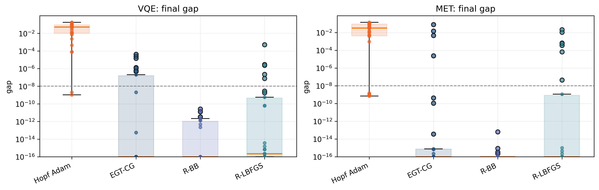
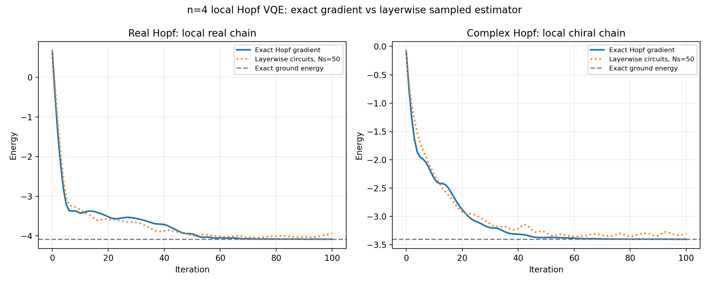

# Hopf Ansatz Stress-Test Code

This repository contains reproducible synthetic stress-test code for the Hopf ansatz.

The code generates real- and complex-Hopf VQE and metrology-inspired optimization traces, runs seed-aware diagnostics, produces GitHub-facing comparison plots, and includes standalone safeguards for the Hopf CNOT-count formulas and Qibo layerwise gradient-access circuits.

Full generated CSV datasets are intentionally not tracked in GitHub because they are large derived artifacts. They can be regenerated from deterministic scripts; see `REPRODUCIBILITY.md`. The included `VQE_qibo.png` and `complex_stress_summary.pdf` files are small release artifacts that can be regenerated from `VQE_qibo.py` and `hopf_complex.py`, respectively. Diagnostic text files and full data files are generated locally and are ignored by default.

## Repository contents

| File | Role |
|---|---|
| `hopf_utils.py` | Core Hopf utilities: real and complex coordinate maps, inverse maps, Jacobians, diagonal metrics, tangent-state assignments, gate schedules, and optional Qibo circuit checks. |
| `hopf_data.py` | Generates synthetic stress-test CSVs for the three geometry-native Hopf optimizers. |
| `adam_data.py` | Generates synthetic stress-test CSVs for the two adaptive Adam baselines. |
| `diagnose_hopf.py` | Checks completeness and numerical quality of Hopf optimizer CSVs. |
| `diagnose_adam.py` | Checks completeness and numerical quality of Adam baseline CSVs. |
| `plot_hopf.py` | Generates summary and convergence plots from the real-Hopf and Adam CSVs. |
| `hopf_complex.py` | Focused complex-Hopf stress test at `n=6`. It runs the same six VQE and metrology-inspired objective families with complex scrambling, ten deterministic initial states per task, and four optimizer tracks; it writes the CSV, prints diagnostics, and produces the final-gap summary plot. |
| `hopf_complex.png` | Included final-gap summary for the default complex-Hopf stress test. |
| `hopf_gate_count.py` | Safeguard script for the CNOT-count formulas. It builds real and complex Hopf gate schedules and checks numerical counts against the closed-form binomial formulas. |
| `VQE_qibo.py` | Functional Qibo/statevector layerwise gradient-access safeguard for local `n=4` real and complex Hopf VQE toys; compares exact Hopf-gradient Adam with sampled layerwise-circuit Adam. This is a local circuit-realizability demo, not the asymptotically optimized indexed-gradient scaling implementation. |
| `VQE_qibo.png` | Included output panel from `VQE_qibo.py`, showing the real and complex `n=4` local toy trajectories. |

## Scope relative to the paper

The paper is kept focused on the analytic construction. This repository carries implementation-level material: inverse-map checks, metric/Jacobian consistency checks, tangent-state synthesis checks, generated gate schedules, CNOT-count safeguards, the multi-size real-Hopf optimizer traces, a focused complex-Hopf stress test, and a small real/complex layerwise gradient-access toy. These scripts make the construction inspectable without adding more detail to the manuscript.

Hopf is used here as an optimization chart, not just as an amplitude loader. Existing state-preparation constructions address loading; this code focuses on the additional structures used in the paper's optimizer story: an explicit inverse chart, a diagonal metric, tangent-state assignments on the same circuit skeleton, and layerwise circuit checks. The Qibo/statevector demo is a local realizability safeguard, not a complete hardware-resource or sampling-complexity analysis.

## Synthetic tasks

The main multi-size synthetic dataset uses six scrambled real-state tasks. Each task is scrambled by a fixed real orthogonal circuit, preventing the optimizers from exploiting an obvious computational-basis target. The focused complex experiment in `hopf_complex.py` repeats the same six objective families at `n=6` with complex unitary scrambling.

The VQE test contains three scrambled Hamiltonian tests:

**Parent Hamiltonian:** recover a scrambled target state by minimizing the parent-Hamiltonian gap. The task cost is the missing target overlap,

```math
\mathcal{C}_{\mathrm{parent}}(\psi)
=
1 - |\langle \tau|\psi\rangle|^2 .
```

Here τ is the scrambled target state. The minimum is zero, reached when the variational state ψ equals τ up to the real global sign convention used in the code.

**Hamming spectrum:** minimize a structured diagonal Hamming-distance spectrum hidden by a real orthogonal scrambling circuit. The task cost is the expected normalized Hamming distance in the unscrambled basis,

```math
\mathcal{C}_{\mathrm{Ham}}(\psi)
=
\sum_x
\frac{d_{\mathrm{H}}(x,x_0)}{n}
\,
|(S^\top\psi)_x|^2 .
```

Here S is the fixed real scrambler and x₀ is the hidden target bit string. Physically, this tests whether the optimizer can find the scrambled computational-basis ground state of a simple but hidden diagonal spectrum.

**Small-gap spectrum:** minimize a scrambled Hamiltonian with a deliberately small spectral gap near the ground state. The task cost is the expected value of a scrambled diagonal spectrum,

```math
\mathcal{C}_{\mathrm{gap}}(\psi)
=
\sum_x
E_x
|(S^\top\psi)_x|^2 ,
```

with

```math
E_{x_0}=0,\qquad
E_{x_1}=10^{-2},\qquad
E_x=1\ \text{for all other }x .
```

The physical stress feature is the nearby distractor state x₁: the optimizer must distinguish the true ground state from a low-lying excited state.

The metrology test contains three nonlinear sensing-inspired tests:

**Single-target Fisher:** maximize a fixed-readout Fisher proxy for one scrambled target state. The task cost is

```math
\mathcal{C}_{\mathrm{single}}(\psi)
=
1 - F,
\qquad
F =
|\langle \tau|\psi\rangle|^4 .
```

Equivalently, the code first computes the target probability A = |⟨τ|ψ⟩|² and then uses F = A². Physically, this rewards concentration of the probe state on one scrambled readout pattern.

**QFI superposition:** maximize normalized pure-state QFI for a scrambled diagonal generator. In the unscrambled basis, the code computes

```math
\mu =
\sum_x g_x |(S^\top\psi)_x|^2,
\qquad
\nu =
\sum_x g_x^2 |(S^\top\psi)_x|^2,
```

and then uses the normalized QFI objective

```math
F_Q^{\mathrm{norm}}(\psi)
=
\frac{4(\nu-\mu^2)}{\mathrm{span}(G)^2}.
```

The task cost is

```math
\mathcal{C}_{\mathrm{QFI}}(\psi)
=
1 - F_Q^{\mathrm{norm}}(\psi).
```

Physically, this rewards a probe state with large generator variance. The optimum is an equal superposition of the scrambled minimum- and maximum-generator eigenstates.

**Balanced Fisher:** optimize a two-target Fisher objective where the optimum requires balanced overlap with two scrambled target states. The code computes

```math
e_1 = |\langle \tau_1|\psi\rangle|^2,
\qquad
e_2 = |\langle \tau_2|\psi\rangle|^2,
```

then

```math
F_1=e_1^2,
\qquad
F_2=e_2^2.
```

The balanced Fisher score is a soft minimum,

```math
F_{\mathrm{bal}}(\psi)
=
-\frac{1}{\beta}
\log\!\left(
\frac{
e^{-\beta F_1}
+
e^{-\beta F_2}
}{2}
\right),
\qquad
\beta=20 .
```

The task cost is

```math
\mathcal{C}_{\mathrm{bal}}(\psi)
=
\frac{1}{4}
-
F_{\mathrm{bal}}(\psi).
```

The optimum has balanced probability on the two scrambled targets, giving approximately e₁ = e₂ = 1/2, hence F₁ = F₂ = 1/4 and zero cost.

Lower cost or gap is better in all diagnostic summaries.

To regenerate the real-Hopf plots locally, generate the datasets and run `plot_hopf.py`; see the sections below. The complex-Hopf script generates its CSV, diagnostics, and summary plot through one entry point.

## Requirements

Use Python 3.10 or newer.

Install the required packages for data generation, diagnostics, CNOT counting, and plotting:

```bash
python -m pip install -r requirements.txt
```

Optional packages for explicit circuit-level checks:

```bash
python -m pip install -r requirements-optional.txt
```

`qibo` is used by optional circuit checks in `hopf_utils.py` and by `VQE_qibo.py` when running the explicit Qibo sampler. The synthetic data-generation, diagnostic, CNOT-count, and plotting scripts do not require Qibo.

For a minimal local check without generating the full CSV archive, run the smoke-test commands in `REPRODUCIBILITY.md`.

## Optimizer modes

### Geometry-native Hopf optimizers

Generated by `hopf_data.py`:

```text
Hopf-EGT-CG
Hopf-Riemannian-LBFGS
Hopf-Riemannian-BB
```

These modes use the same cost-plus-Hopf-coordinate-gradient interface. The Hopf diagonal metric is used to lift coordinate gradients to state-sphere gradients, and accepted states are mapped back to Hopf coordinates.

### Adam baselines

Generated by `adam_data.py`:

```text
Hopf-Adam
Mottonen-ideal-PS-Adam
```

`Hopf-Adam` applies Adam directly to Hopf coordinates.

`Mottonen-ideal-PS-Adam` applies Adam to the physical post-multiplexing Möttönen rotation angles with an exact gradient equivalent to infinite-shot parameter shift.

Both Adam baselines use adaptive cost-only backtracking. The diagnostics record the associated trial-evaluation counter, but these baselines are intended as implementation diagnostics rather than a standalone resource-accounting study.

## Complex Hopf stress test

`hopf_complex.py` provides a focused repository-level check of the complex Hopf extension. It repeats the same three VQE and three metrology-inspired objective families used in the real study, replacing the real orthogonal scrambling circuits with complex unitary scrambling circuits. It depends on `hopf_utils.py` in the same directory.

The default experiment uses:

```text
n = 6
3 VQE tasks
3 metrology-inspired tasks
10 deterministic initial states per task
200 accepted optimizer updates
```

The four tracks are:

```text
Hopf-Adam
Hopf-EGT-CG
Hopf-Riemannian-BB
Hopf-Riemannian-LBFGS
```

A complex Möttönen-Adam baseline is not included because a directly comparable extension of our chosen real post-multiplexing $R_y$ chart to a complex $R_y/R_z$ physical-angle chart was not implemented or validated here.

Run the default experiment with:

```bash
python hopf_complex.py
```

This writes:

```text
complex_hopf_stress_data.csv
hopf_complex.png
```

The CSV is a generated artifact and is not intended to be tracked in source control. The PDF contains one two-panel final-gap figure with the same meaning, optimizer order, plotting conventions, and color code as the upper row of the main real-Hopf summary figure.

For a minimal local check, run:

```bash
python hopf_complex.py --quick
```

To regenerate the diagnostics and plot from an existing CSV without rerunning the optimizers:

```bash
python hopf_complex.py --plot-only
```

The default run completed all `240` expected task-seed-mode traces and all `48,240` expected rows, with no missing steps, nonfinite gaps, materially negative gaps, or traces whose final gap was worse than their initial gap. The maximum state-norm error was `4.441e-16`. R-BB reached the `10^-8` threshold in all `30` VQE and all `30` metrology-inspired traces. EGT-CG and R-LBFGS had near-machine-precision medians with small slow-convergence tails, while coordinate Hopf-Adam retained substantially larger aggregate gaps.



Roundoff-level negative final gaps are retained in the terminal diagnostics and clipped only when plotting on a logarithmic axis.

## Seed convention

By default, every fixed synthetic task is run from `10` deterministic initial-state seeds.

The default seed rule is:

```text
run_seed = problem_seed + seed_offset + seed_index
```

with:

```text
seed_offset = 77777
seed_index = 0, 1, ..., num_seeds - 1
```

The default `num_seeds` is `10`. `hopf_complex.py` uses the same rule for its complex initial states.

To change the number of initial states, pass the same value to both the data-generation and diagnostic scripts:

```bash
python hopf_data.py --n 8 --num-seeds 5 --outdir data
python adam_data.py --n 8 --num-seeds 5 --outdir data

python diagnose_hopf.py --indir data --ns 8 --num-seeds 5
python diagnose_adam.py --indir data --ns 8 --num-seeds 5
```

## Diagnostics

Run diagnostics after generating the datasets.

```bash
repo_root="$(pwd)"
mkdir -p diagnostics

python diagnose_hopf.py \
    --indir data \
    --ns 6-10 \
    --steps 200 \
    --num-seeds 10 \
    --out "$repo_root/diagnostics/hopf_data_diagnostics.txt"

python diagnose_adam.py \
    --indir data \
    --ns 6-10 \
    --steps 200 \
    --num-seeds 10 \
    --out "$repo_root/diagnostics/adam_data_diagnostics.txt"
```

The reports check:

- expected files and row counts;
- expected task, mode, seed, and step completeness;
- CSV parse errors;
- sampled parameter and gradient vector lengths;
- nonfinite metrics or gradients;
- state-norm errors;
- aggregate final gaps;
- win counts and final rankings.

The diagnostic scripts are streaming and avoid loading the full vector columns into pandas.
`diagnose_hopf.py` and `diagnose_adam.py` resolve relative `--out` paths inside `--indir`; the commands above use absolute output paths to keep the reports in the top-level `diagnostics/` directory.

## Optional Hopf utility checks

Run:

```bash
python hopf_utils.py
```

This executes consistency checks for inverse mapping, tangent-state synthesis, metric/Jacobian agreement, and optional Qibo circuit agreement when Qibo is installed.

## Safeguard scripts

The repository includes two standalone safeguard scripts. They are separate from the main synthetic-data pipeline. `VQE_qibo.png` is included as a small release panel for the local `n=4` Qibo/statevector layerwise-circuit check; other generated safeguard outputs can be regenerated locally. The Qibo script is a functional circuit-realizability safeguard, not the asymptotically optimized indexed-gradient scaling implementation.

### CNOT-count safeguard

Run:

```bash
python hopf_gate_count.py
```

This prints a table of real and complex Hopf CNOT counts for the default range `n = 4, ..., 20`, using the no-clean-ancilla CNOT model stated in the paper. It also saves a local plot named:

```text
hopf_gate_count.pdf
```

To choose a smaller range and write the local output into a generated-figure folder:

```bash
mkdir -p figures_safeguards

python hopf_gate_count.py \
    --nmin 2 \
    --nmax 10 \
    --out figures_safeguards/hopf_gate_count.pdf
```

The script compares counts obtained directly from the generated Hopf gate schedules against the closed-form binomial count formulas. The saved plot is only a local check and is not shown in this README.

### Qibo layerwise gradient-access safeguard

Run:

```bash
MPLBACKEND=Agg python VQE_qibo.py
```

This script runs two local `n=4` VQE toy models:

- **Real Hopf:** a real nearest-neighbor chain with `X`, `Z`, `XX`, `YY`, and `ZZ` terms.
- **Complex Hopf:** a local chiral chain with `X`, `Y`, `Z`, `XX`, `YY`, `ZZ`, and `XY - YX` terms.

For each toy, Adam uses a fixed learning rate and a fully random initialization. The plot compares the exact Hopf-gradient trajectory with the sampled layerwise-circuit trajectory. The layerwise estimator uses the baseline energy, indexed derivative-layer energies, and indexed signed-branch energies; the complex toy also uses the single indexed phase layer. The explicit-Qibo path builds label-controlled local circuits for clarity at `n=4`; it intentionally does not optimize control sharing or compile-depth asymptotics.

The setting counts per Pauli readout are:

```text
real Hopf:    1 + 2*4 = 9
complex Hopf: 1 + 2*5 = 11
```

The script writes:

```text
VQE_qibo.png
```



The included panel shows the sampled layerwise-circuit trajectories tracking the exact-gradient trajectories and approaching the exact ground-energy lines for both local toy Hamiltonians. This is a local circuit-realizability check for the Hopf gradient-access protocol, not a synthetic stress-test result or an asymptotic gate-count benchmark.

## Reproducibility notes

The scripts use deterministic random seeds by default. Re-running the same commands with the same Python, NumPy, and SciPy versions should reproduce the same synthetic task definitions and initial-state seeds.

In Hopf CSVs, `last_line_evals` is a line-search work counter. It includes trial objective evaluations and, when strong-Wolfe curvature checks are reached, gradient-oracle calls used only by the line search. In Adam CSVs, `last_line_evals` counts adaptive cost-only trial evaluations.

The multi-size datasets generated by `hopf_data.py` and `adam_data.py` use the real Hopf chart. `hopf_complex.py` provides a focused `n=6` complex-chart extension using the same six objective families and four Hopf optimizer tracks. `hopf_utils.py` contains the shared real and complex Hopf maps, inverse maps, Jacobians, metrics, and tangent-state utilities, while `VQE_qibo.py` exercises both versions in small local circuit-level examples.

## Citation

If you use this code, cite the accompanying Hopf ansatz paper.
