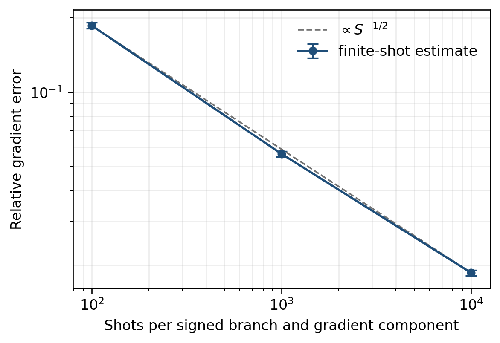

# Experiments and safeguards

This page documents the numerical evidence in the Hopf-ansatz repository. It
separates task design, optimizer comparisons, circuit safeguards, sampling
checks, and resource checks so that one experiment is not used to support a
claim outside its scope.

## 1. Evidence map

| Study | Main script | Default scale | Primary question |
|---|---|---:|---|
| Multi-size real Hopf study | `hopf_data.py` | `n = 6, ..., 10`, six tasks, ten seeds, three geometry modes | Can the chart support stable geometry-aware optimization across deterministic scrambled tasks? |
| Real Adam baselines | `adam_data.py` | Same sizes, tasks, and seeds, two baseline modes | How do coordinate Adam and a real Möttönen physical-angle Adam behave under a matched task pipeline? |
| Focused complex Hopf study | `hopf_complex.py` | `n = 6`, six tasks, ten seeds, four Hopf modes | Does the complex chart and its geometry behave consistently on the same task families? |
| Finite-shot gradient check | `finite_shot_sanity_check.py` | One real `n = 6` state, 63 coordinates, three shot counts, 50 trials | Does the symmetric signed-branch estimator reproduce the exact gradient and show square-root sampling behavior? |
| Local layerwise-circuit VQE | `VQE_qibo.py` | Two local `n = 4` Hamiltonians | Can the real and complex layerwise gradient identities be realized by explicit small circuits? |
| Gate-count safeguard | `hopf_gate_count.py` | Default `n = 4, ..., 20` | Do generated schedules match the declared closed-form logical CNOT ledger? |

The first three are optimizer studies. The next two are gradient-access
safeguards. The last is a compiler-ledger check. None is a physical-device
benchmark.

## 2. Shared synthetic tasks

The real and focused complex studies use the same six objective families. Each
task is hidden by a deterministic scrambling circuit so that the optimizer does
not receive an obvious computational-basis solution.

Lower cost or gap is better throughout the diagnostic and plotting pipeline.

### 2.1 Parent Hamiltonian

For a normalized scrambled target `tau`,

```math
\mathcal{C}_{\mathrm{parent}}(\psi)
=
1-
|\langle\tau|\psi\rangle|^2.
```

The minimum is zero at the target ray.

### 2.2 Hamming spectrum

Let `x_0` be a hidden target bit string and `S` the fixed scrambler. In the
unscrambled basis,

```math
\mathcal{C}_{\mathrm{Ham}}(\psi)
=
\sum_x
\frac{d_{\mathrm H}(x,x_0)}{n}
\left|\left(S^\dagger\psi\right)_x\right|^2.
```

The spectrum is structured but the target basis is hidden by `S`.

### 2.3 Small-gap spectrum

The diagonal spectrum before scrambling is

```math
E_{x_0}=0,
\qquad
E_{x_1}=10^{-2},
\qquad
E_x=1
\quad
\text{otherwise}.
```

The cost is

```math
\mathcal{C}_{\mathrm{gap}}(\psi)
=
\sum_x E_x
\left|\left(S^\dagger\psi\right)_x\right|^2.
```

The nearby distractor `x_1` tests whether an optimizer separates the true ground
state from a low-lying alternative.

### 2.4 Single-target Fisher proxy

Define

```math
A
=
|\langle\tau|\psi\rangle|^2,
\qquad
F=A^2.
```

The minimized cost is

```math
\mathcal{C}_{\mathrm{single}}
=
1-F.
```

### 2.5 QFI extremal superposition

For a scrambled diagonal generator with moments

```math
\mu
=
\sum_x g_x
\left|\left(S^\dagger\psi\right)_x\right|^2,
\qquad
\nu
=
\sum_x g_x^2
\left|\left(S^\dagger\psi\right)_x\right|^2,
```

use the normalized pure-state QFI

```math
F_Q^{\mathrm{norm}}
=
\frac{4(\nu-\mu^2)}{\mathrm{span}(G)^2},
```

and minimize

```math
\mathcal{C}_{\mathrm{QFI}}
=
1-F_Q^{\mathrm{norm}}.
```

The optimum is supported on the scrambled minimum- and maximum-generator
eigenstates.

### 2.6 Balanced Fisher

For two scrambled targets,

```math
e_1=|\langle\tau_1|\psi\rangle|^2,
\qquad
e_2=|\langle\tau_2|\psi\rangle|^2,
```

and

```math
F_1=e_1^2,
\qquad
F_2=e_2^2.
```

The soft minimum is

```math
F_{\mathrm{bal}}
=
-\frac{1}{\beta}
\log\!\left(
\frac{e^{-\beta F_1}+e^{-\beta F_2}}{2}
\right),
\qquad
\beta=20,
```

with cost

```math
\mathcal{C}_{\mathrm{bal}}
=
\frac{1}{4}-F_{\mathrm{bal}}.
```

The optimum requires balanced probability on the two targets rather than
collapse onto only one.

## 3. Scrambling and seed control

### Real study

`hopf_data.py` and `adam_data.py` use the same deterministic real orthogonal
scrambler for a given task. Each layer contains real `R_y` rotations and a
brickwork CNOT pattern.

### Complex study

`hopf_complex.py` adds deterministic phase rotations to the same broad
brickwork structure, producing a genuinely complex unitary scrambler.

### Initial-state seed rule

For every fixed task,

```text
run_seed = problem_seed + seed_offset + seed_index
```

with default values

```text
seed_offset = 77777
seed_index = 0, 1, ..., 9
```

All optimizer modes for one task and `run_seed` start from the same state. The
diagnostic scripts check this condition where the stored data permit it.

## 4. Multi-size real geometry study

### Optimizer tracks

`hopf_data.py` runs:

```text
Hopf-EGT-CG
Hopf-Riemannian-LBFGS
Hopf-Riemannian-BB
```

All three use:

- objective values;
- Hopf coordinate gradients;
- the diagonal Hopf metric;
- state-sphere gradients;
- exact sphere geodesics; and
- geometry-compatible transport where required.

The chart is therefore held fixed while the state-sphere optimization method is
varied.

### Default design

For every `n` in `6, 7, 8, 9, 10`:

```text
3 VQE tasks
3 metrology-inspired tasks
10 initial states per task
3 optimizer modes
200 accepted updates plus step 0
```

Each task family writes a separate CSV:

```text
vqe_hopf_data_n{n}.csv
met_hopf_data_n{n}.csv
```

For one `n`, each file contains

```text
3 tasks * 10 seeds * 3 modes * 201 rows = 18,090 rows.
```

### Generate the data

```bash
mkdir -p data

for n in 6 7 8 9 10; do
    python hopf_data.py \
        --n "$n" \
        --steps 200 \
        --num-seeds 10 \
        --outdir data
done
```

For a development run:

```bash
python hopf_data.py --n 6 --quick --num-seeds 1 --outdir smoke
```

### Recorded fields

The CSV schema includes:

- task family, task identifier, problem seed, and run seed;
- optimizer mode and step;
- coordinate type, dimension, and parameter count;
- cost and application-specific gap metrics;
- coordinate-gradient and state-gradient norms;
- state-normalization error;
- accepted step angle and line-search work;
- elapsed wall time; and
- serialized coordinate and gradient vectors.

Wall time is recorded for diagnostics, but this repository does not present it
as a controlled performance benchmark.

## 5. Real Adam baseline study

`adam_data.py` runs the same real tasks and initial states for:

```text
Hopf-Adam
Mottonen-ideal-PS-Adam
```

### Hopf-Adam

Adam acts directly on real Hopf coordinates. A cost-only adaptive line search
selects a scalar step along the Adam direction.

### Möttönen baseline

The baseline acts on the physical post-multiplexing real `R_y` angles of a
Möttönen-style state-preparation chart.

By default, the gradient is a fast exact adjoint calculation equivalent to the
infinite-shot parameter-shift result. A literal two-shift path is available
through:

```text
--mottonen-gradient literal
```

The baseline is therefore a coordinate/optimization comparison under exact
gradients, not a finite-shot measurement-cost comparison.

### Generate the baseline data

```bash
for n in 6 7 8 9 10; do
    python adam_data.py \
        --n "$n" \
        --steps 200 \
        --num-seeds 10 \
        --outdir data
done
```

Each VQE or metrology file contains

```text
3 tasks * 10 seeds * 2 modes * 201 rows = 12,060 rows.
```

### Matching limits

The task definitions and seed rule are matched across the real Hopf and Adam
pipelines. The optimizer mechanics are intentionally not identical:
geometry-native methods use state-sphere line searches and transport, while the
Adam modes use coordinate updates and cost-only backtracking.

This is a scientific comparison of specified algorithms, not a claim that all
methods received identical internal operations.

## 6. Diagnostics for regenerated real data

Run:

```bash
repo_root="$(pwd)"
mkdir -p diagnostics

python diagnose_hopf.py \
    --indir data \
    --ns 6-10 \
    --steps 200 \
    --num-seeds 10 \
    --out "$repo_root/diagnostics/hopf_data_diagnostics.txt"

python diagnose_adam.py \
    --indir data \
    --ns 6-10 \
    --steps 200 \
    --num-seeds 10 \
    --out "$repo_root/diagnostics/adam_data_diagnostics.txt"
```

The diagnostic scripts check:

- expected files;
- task, seed, mode, and step completeness;
- duplicate or missing traces;
- nonfinite costs, gaps, and gradients;
- state-normalization error;
- final versus initial performance;
- threshold hits and mode rankings;
- sampled coordinate and gradient vector lengths; and
- line-search work counters.

They stream scalar columns and avoid parsing every large vector field by
default.

### Interpretation of `last_line_evals`

In geometry-native CSVs, this field is a line-search work counter. Strong-Wolfe
curvature checks may include gradient-oracle calls as well as trial costs. In
Adam CSVs, it counts cost-only trial evaluations.

It is not a finite-shot count and should not be plotted as one.

## 7. Real-study plots

After generating and diagnosing the CSVs:

```bash
mkdir -p figures

python plot_hopf.py \
    --indir data \
    --adam-dir data \
    --outdir figures \
    --ns 6-10 \
    --detail-n 10 \
    --formats pdf png
```

The script produces:

```text
hopf_geometric_summary_clean.pdf/.png
hopf_geometric_n10_convergence_clean.pdf/.png
```

The summary aggregates final gaps and threshold-hitting steps across tasks,
sizes, and seeds. The detail figure shows seed-aware convergence at the selected
size.

### Paper-reported aggregate reproduction targets

The paper aggregates `150` traces per optimizer in each application class:
three tasks, five sizes, and ten initial states. The reported final-gap targets
are:

| Mode | VQE mean | VQE median | Metrology mean | Metrology median |
|---|---:|---:|---:|---:|
| `Hopf-EGT-CG` | `9.23e-6` | `1.02e-25` | `1.56e-3` | `0` |
| `Hopf-Riemannian-BB` | `1.61e-12` | `1.02e-25` | `5.74e-3` | `0` |
| `Hopf-Riemannian-LBFGS` | `3.21e-5` | `5.30e-17` | `2.36e-3` | `1.67e-16` |
| `Mottonen-ideal-PS-Adam` | `3.47e-3` | `7.35e-4` | `1.53e-3` | `3.67e-4` |
| `Hopf-Adam` | `7.01e-2` | not separately highlighted | `7.96e-2` | not separately highlighted |

These numbers are reproduction targets, not arrays embedded in the plotting
code. A reviewer should regenerate the CSVs, run both diagnostic scripts, and
create the figures from those same files. Tiny differences at roundoff-level
medians can depend on the numerical environment.

### Repository policy for the full real study

The full CSV archive is a large derived artifact. The repository therefore
stores source scripts, expected aggregate targets, diagnostic checks, and
reproduction commands rather than committing every trace and derived figure.

## 8. Focused complex-Hopf study

### Optimizer tracks

`hopf_complex.py` runs:

```text
Hopf-Adam
Hopf-EGT-CG
Hopf-Riemannian-BB
Hopf-Riemannian-LBFGS
```

No complex Möttönen baseline is included because a directly comparable complex
physical-angle implementation was not implemented and validated in this
repository.

### Default design

```text
n = 6
6 tasks
10 complex initial states per task
4 optimizer tracks
200 accepted updates plus step 0
```

The resulting CSV contains

```text
6 * 10 * 4 * 201 = 48,240 rows.
```

### Built-in self-checks

Before the default experiment, the script checks:

- scrambler inverse consistency;
- fast complex coordinate gradients against the dense Jacobian;
- diagonal-metric lifting against the projected state-space gradient.

After generation it checks:

- expected trace count;
- complete step grids;
- finite and materially nonnegative gaps;
- state-norm errors;
- identical starting gaps across optimizer modes; and
- final threshold counts.

### Run

```bash
python hopf_complex.py
```

Outputs:

```text
complex_hopf_stress_data.csv
hopf_complex.png
```

A quick check is:

```bash
python hopf_complex.py --quick --outdir smoke
```

Regenerate the plot and diagnostics from an existing CSV with:

```bash
python hopf_complex.py --plot-only
```

### Committed default-run notes

The documented release run completed all 240 expected traces and all 48,240
rows. It reported no missing steps, nonfinite gaps, materially negative gaps, or
traces ending worse than they began. The maximum state-norm error was
`4.441e-16`.

In that run, R-BB reached the `1e-8` threshold in all 30 VQE and all 30
metrology-inspired traces. EGT-CG and R-LBFGS had near-roundoff medians with
small slower-convergence tails, while coordinate Hopf-Adam retained larger
aggregate gaps.

These are results of the stated deterministic synthetic experiment. They are
not a matched comparison against a complex Möttönen implementation or against
hardware-native ansätze.

<p align="center">
  
</p>

## 9. Finite-shot signed-branch check

### Objective

`finite_shot_sanity_check.py` isolates the statistical layer of the symmetric
real-Hopf gradient estimator.

It fixes:

```text
n = 6
63 real Hopf coordinates
one deterministic interior state
one normalized diagonal Hamming-spectrum observable
```

For every coordinate it prepares the exact normalized tangent and the two
states

```math
|\varphi_i^{(\pm)}\rangle
=
\frac{|\psi\rangle\pm|t_i\rangle}{\sqrt{2}}.
```

It first checks exact branch energies against an independent tree gradient and a
dense Jacobian reference. It then samples each branch energy.

### Shot convention

For command-line value `S`:

```text
plus branch:  S samples per coordinate
minus branch: S samples per coordinate
combined:     2*S branch-state samples per coordinate
```

This is not one common budget shared across the complete gradient.

### Default run

```bash
python finite_shot_sanity_check.py
```

Outputs:

```text
finite_shot_sanity_data.csv
finite_shot_sanity.png
```

Generate both PNG and PDF with:

```bash
python finite_shot_sanity_check.py --formats png pdf
```

### Documented default diagnostics

```text
exact branch-identity residual       2.513e-16
Tree/Jacobian reference residual     2.355e-16
maximum |<psi|tangent>|              2.220e-16

shots/branch     mean relative error        SEM
100              0.186020                   0.005300
1,000            0.056339                   0.001429
10,000           0.018599                   0.000477

log-log slope of mean error          -0.500036
ideal independent-shot slope         -0.5
```

The slope is consistent with the expected square-root statistical trend for
this fixed-state estimator.

### Exclusions

The experiment does not model:

- Hamiltonian Pauli grouping;
- a shared global shot budget;
- indexed-label allocation;
- state-preparation or readout noise;
- device drift;
- adaptive stopping; or
- optimizer feedback from noisy gradients.

<p align="center">
  
</p>

## 10. Local Qibo layerwise safeguard

### Systems

`VQE_qibo.py` defines two fixed `n = 4` local Hamiltonians:

- a real chain with `X`, `Z`, `XX`, `YY`, and `ZZ` terms;
- a complex chiral chain adding `Y` fields and `XY - YX` couplings.

### Compared trajectories

For each system, fixed-rate Adam is run with:

- the exact dense Hopf gradient; and
- a sampled layerwise gradient estimator.

The script checks the exact layerwise energy identity at the initial state before
running the sampled trajectory.

### Setting structure

Per Pauli readout term:

```text
real Hopf:    1 baseline + 2*4 indexed layers = 9 settings
complex Hopf: 1 baseline + 2*5 indexed layers = 11 settings
```

The complex count includes one indexed phase family in addition to magnitude
depths.

`Ns` is the number of shots per label, sign, and Pauli readout within a setting.
It is not the total number of shots used by one optimizer iteration.

### Run

```bash
MPLBACKEND=Agg python VQE_qibo.py
```

The default `--sampler auto` uses explicit Qibo circuits when Qibo is available
and otherwise uses an equivalent statevector sampling path.

Force the explicit circuit path with:

```bash
MPLBACKEND=Agg python VQE_qibo.py --sampler qibo-explicit
```

### Scope

This is a local circuit-realizability safeguard. It is not:

- the asymptotically optimized indexed compiler;
- a gate-scaling study;
- a hardware-noise study;
- a comparison with parameter shift at matched total shots; or
- evidence that the same fixed Adam settings solve arbitrary VQE instances.

<p align="center">
  
</p>

## 11. CNOT-count safeguard

`hopf_gate_count.py` builds both native schedules and evaluates the declared
no-clean-ancilla logical CNOT model.

Run:

```bash
python hopf_gate_count.py
```

or a smaller range:

```bash
python hopf_gate_count.py \
    --nmin 2 \
    --nmax 10 \
    --out hopf_gate_count.pdf
```

The script compares:

- direct counts from `Ctrl`, `Anti`, `Targ`, and `Index`; and
- the closed-form real and complex binomial formulas.

The plotted normalization `#CNOT / (n * 2**n)` visualizes the assigned asymptotic
scale. It does not measure compiled device cost.

## 12. Interpretation matrix

| Observation | Supported interpretation | Unsupported promotion |
|---|---|---|
| Forward/inverse residual near roundoff | The implemented maps agree on tested states | Numerical proof of universality |
| Metric lift agrees with dense Jacobian | Fast geometry implementation is consistent at tested points | Proof of all chart identities |
| Geometry methods converge on synthetic tasks | The specified chart and optimizers work on those deterministic tests | Universal superiority over all ansätze or optimizers |
| Complex study passes self-checks | The complex implementation is internally consistent at the tested scale | Matched advantage over a complex physical-angle baseline |
| Finite-shot slope near `-1/2` | The fixed signed-branch estimator exhibits expected sampling behavior | End-to-end full-gradient or hardware sample complexity |
| Qibo toy tracks the exact trajectory | The local layerwise circuit construction is realizable | Asymptotically optimized compilation or device performance |
| Schedule count equals formula | The implemented ledger and generated schedule agree | Transpiler, routing, or fault-tolerant resource count |

## 13. Reproduction routes

### Lightweight route

Use the smoke commands in
[REPRODUCIBILITY.md](../REPRODUCIBILITY.md). They exercise every code family
without generating the complete real CSV archive.

### Full reviewer route

1. Create a clean environment.
2. Run `hopf_utils.py` and the CNOT safeguard.
3. Generate all real Hopf and Adam CSVs for `n = 6, ..., 10`.
4. Run both streaming diagnostic scripts.
5. Generate the real summary and detail plots.
6. Run the default complex study.
7. Run the default finite-shot study.
8. Run the explicit-Qibo local VQE safeguard.
9. Preserve console logs, dependency versions, and generated diagnostics with
   the review record.

The repository's deterministic seeds make repeated mathematical inputs stable,
but small floating-point differences may occur across BLAS, NumPy, SciPy, and
platform versions.
